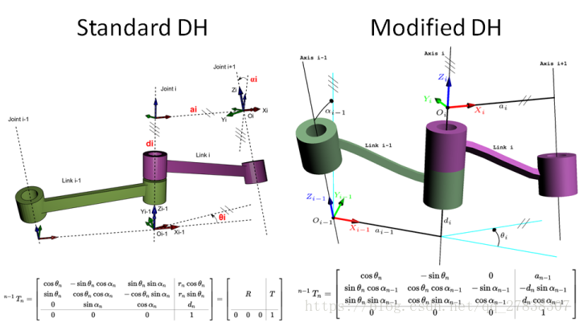

# 建立DH坐标系

+ 改进的DH坐标系


+ 标准的DH坐标系


这两种坐标系分别对应的变换矩阵



# Matlab编程

## 以改进的DH坐标系为例

计算变换矩阵

```matlab
function A = cal_DH_modified(theta,d,a,alpha)

A = [       cos(theta)            -sin(theta)          0              a;
     sin(theta)*cos(alpha) cos(theta)*cos(alpha)  -sin(alpha)   -sin(alpha)*d;
     sin(theta)*sin(alpha) cos(theta)*sin(alpha)  cos(alpha)    cos(alpha)*d;
                0                      0               0              1;        ];


end
```

调用function A，计算解析式

```matlab
d1 = 0;        d2 = 0;         d3 = 0;      d4 = 0;      d5 = 59.5;
a1 = 0;        a2 = 0;       a3 = 300;    a4 = 400;    a5 = 0;
alpha1 = 0;    alpha2 = pi/2;  alpha3 = 0;  alpha4 = 0;   alpha5 = -pi/2;  
syms theta1 theta2 theta3 theta4 theta5;

% function A = cal_DH_modified(theta,d,a,alpha)
T01 = cal_DH_modified(theta1, d1, a1, alpha1);
T12 = cal_DH_modified(theta2, d2, a2, alpha2);
T23 = cal_DH_modified(theta3, d3, a3, alpha3);
T34 = cal_DH_modified(theta4, d4, a4, alpha4);
T45 = cal_DH_modified(theta5, d5, a5, alpha5);

T = T01*T12*T23*T34*T45;
out = vpa(T,4);
```

打印out的输出值，编写一个调用out的变换矩阵的函数

例：

```matlab
d1 = 0;        d2 = 0;         d3 = 0;      d4 = 0;      d5 = 59.5;
a1 = 0;        a2 = 0;       a3 = 300;    a4 = 400;    a5 = 0;
alpha1 = 0;    alpha2 = pi/2;  alpha3 = 0;  alpha4 = 0;   alpha5 = -pi/2;  
L1=Link([0     d1       a1       alpha1     ],'modified');
L2=Link([0     d2       a2       alpha2     ],'modified'); % L2.offset = pi/2;
L3=Link([0     d3       a3       alpha3     ],'modified'); % L3.offset = pi/2;
L4=Link([0     d4       a4       alpha4     ],'modified'); % L4.offset = -pi/2;
L5=Link([0     d5       a5       alpha5     ],'modified');
robot=SerialLink([L1 L2 L3 L4 L5],'name','XiaoBei 3.0');
robot.plot([0,0,0,0,0]);
robot.display();
robot.teach();
a = robot.fkine([0 0 1 1 1]);% 输出前向结果
hold on;
```

```matlab
+---+-----------+-----------+-----------+-----------+-----------+
| j |     theta |         d |         a |     alpha |    offset |
+---+-----------+-----------+-----------+-----------+-----------+
|  1|         q1|          0|          0|          0|          0|
|  2|         q2|          0|          0|     1.5708|          0|
|  3|         q3|          0|        300|          0|          0|
|  4|         q4|          0|        400|          0|          0|
|  5|         q5|       59.5|          0|    -1.5708|          0|
+---+-----------+-----------+-----------+-----------+-----------+
```

最后验证

比较a和out


